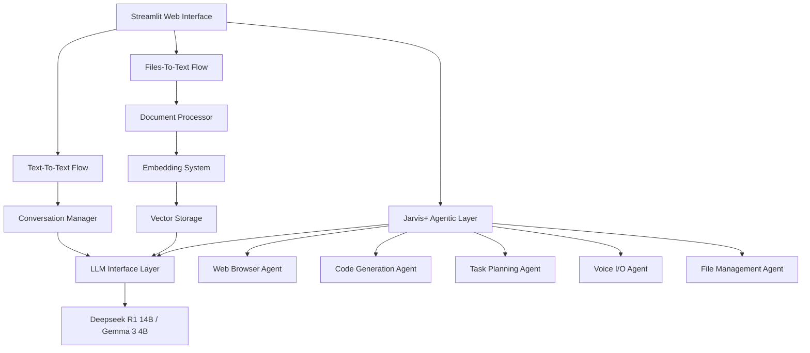
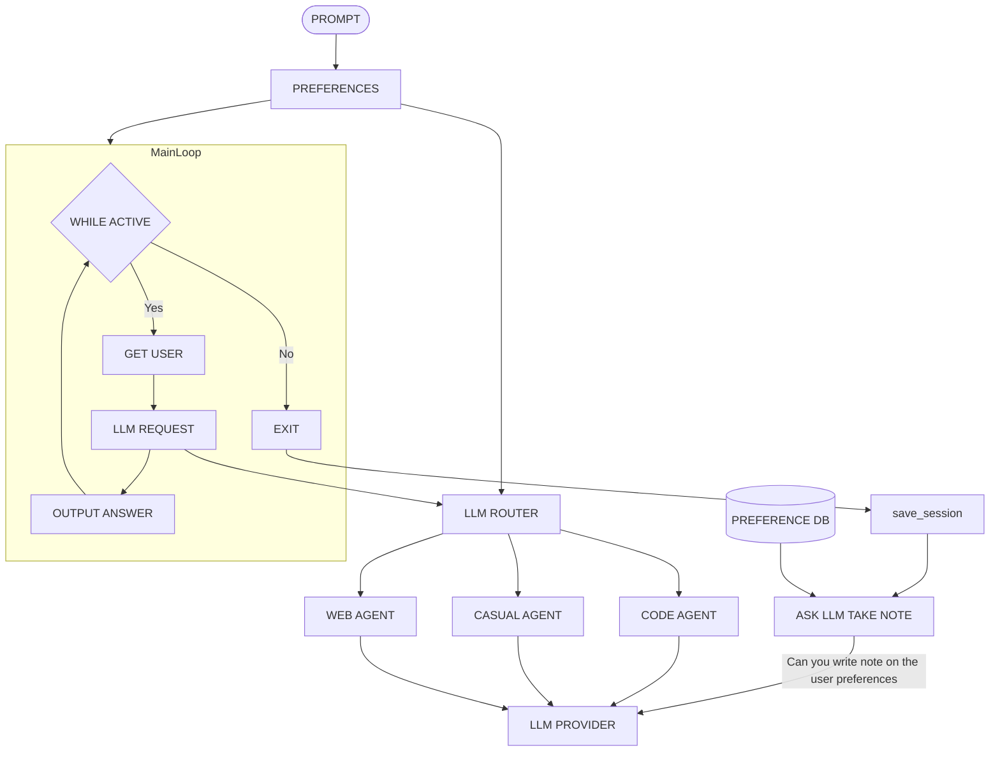
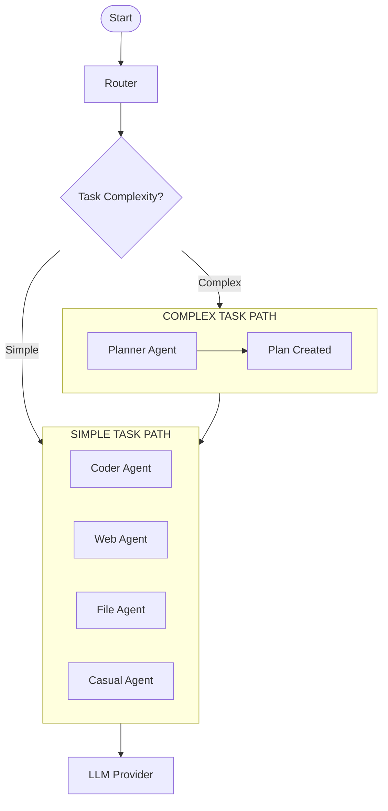
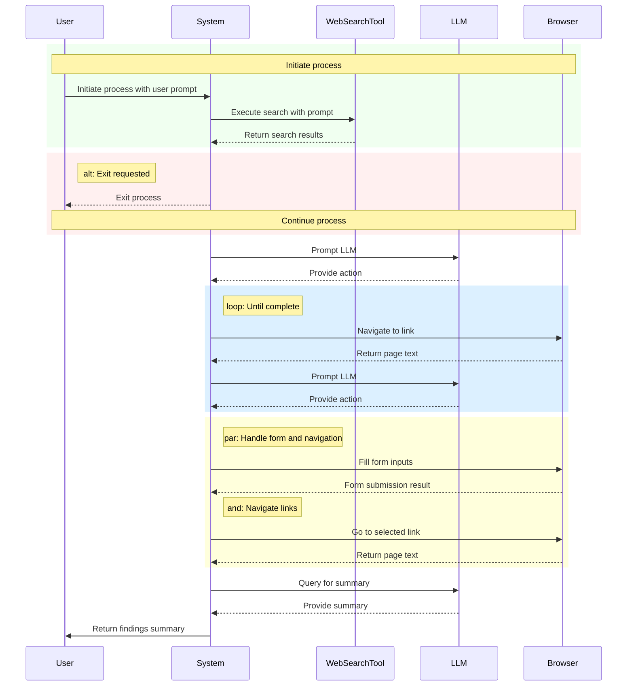
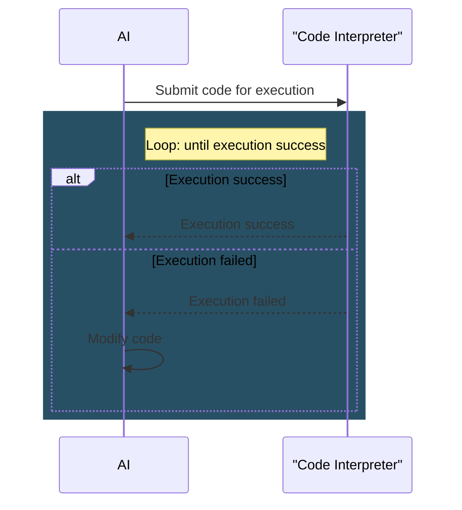

<!-- WARNING: This documentation has been created from the perspective of the Jarvis AI Core. The proper and complete documentation for Jarvis+ is still pending and will be added later in detail. This current documentation is only for temporary use. -->

# Jarvis AI Project

## Demo Video

- [Watch Demo Video With Audio (on YouTube)](https://youtu.be/K3sOIwlo_do?feature=shared)

## Table of Contents
1. [Introduction](#introduction)
2. [System Overview](#system-overview)
3. [Key Features & Capabilities](#key-features--capabilities)
4. [System Requirements](#system-requirements)
5. [Architecture Overview](#architecture-overview)
6. [AI Models](#ai-models)
7. [Core Components](#core-components)
8. [System Diagrams](#system-diagrams)
9. [Installation Guide](#installation-guide)
10. [Configuration](#configuration)
11. [Usage Instructions](#usage-instructions)
12. [Troubleshooting](#troubleshooting)
13. [Future Development](#future-development)
14. [Support & Contribution](#support--contribution)

---

## Introduction

Welcome to the Jarvis AI project! You can find all the project files on GitHub here: [https://github.com/Adarsh-61/JarvisPlus](https://github.com/Adarsh-61/JarvisPlus).

First of all, let's talk about the name "Jarvis." If you're a fan of the Iron Man movies, you'll recognize it. It stands for "Just A Rather Very Intelligent System," the name of Tony Stark's AI assistant. Our project takes inspiration from that concept.

Jarvis AI is a powerful Artificial Intelligence (AI) assistant designed to work completely **offline** on your own computer. This means it doesn't need an internet connection to function (after the initial setup) and doesn't send your data to external servers, ensuring your privacy. It uses advanced AI models to understand language, process documents efficiently, browse the web autonomously, generate code, and much more.

Building this has been a significant undertaking, and I want to express my sincere gratitude to everyone who supported me: the vibrant open-source community, my friends, dedicated mentors, and inspiring teachers. Your contributions and encouragement have been invaluable.

> ⚠️ **WARNING:** This documentation has been created from the perspective of the Jarvis AI Core. The proper and complete documentation for Jarvis+ is still pending and will be added later in detail. This current documentation is only for temporary use.

---

## System Overview

The Jarvis AI project is split into two main components:

1. **Jarvis AI Core:** This is the foundation of the system and handles tasks like understanding and generating text (Text-to-Text) and analyzing the content of your files like PDFs or text documents (Files-to-Text). Think of it as the core brain for text-based tasks.

2. **Jarvis+:** This is the more advanced, agentic part of the project. "Agentic" means it can act more independently and handle a wider variety of tasks, converting almost any type of input to any type of output (Any-to-Any). Jarvis+ adds capabilities like web browsing, code generation, task planning, voice interaction, and more.

Jarvis AI is built with performance, privacy, and flexibility in mind. We've leveraged advanced AI models (LLMs) extensively during development to optimize the codebase, enhance performance, and ensure everything works as smoothly as possible. It brings sophisticated AI capabilities, usually found in large enterprise systems, right to your local machine.

Whether you want to chat with an AI, get help writing something, analyze documents, browse the web autonomously, or generate code, Jarvis AI provides a reliable and private solution that runs entirely on your own hardware.

---

## Key Features & Capabilities

### Jarvis AI Core Features

#### Text-To-Text Conversion
- Engage in natural conversations with the AI
- Ask questions, seek advice, or generate content
- Maintain conversation context for follow-up questions
- Receive detailed, informative responses

#### Files-To-Text Conversion
- Upload documents (PDFs, text files) for AI analysis
- Ask questions about document content
- Generate summaries and extract key information
- Analyze multiple documents simultaneously

#### Core Capabilities
- **Fully Offline Operation**: All processing occurs locally on your machine, ensuring complete privacy and data security
- **Advanced Document Processing**: Optimized extraction, chunking, and caching for efficient document handling
- **Contextual Understanding**: Maintains conversation context for natural follow-up questions and coherent discussions
- **Streaming Responses**: Real-time response generation with token-by-token streaming for immediate feedback
- **Memory Management**: Sophisticated memory handling to optimize performance across different hardware configurations

### Jarvis+ Advanced Capabilities

| Capability             | Description                                    |
|------------------------|------------------------------------------------|
| **Autonomous Browsing**| Hands‑free web search, form filling, data extraction |
| **Code Generation**    | Write, debug, and run code in Python, Go, Java, etc. |
| **Task Planning**      | Break down complex tasks into actionable steps   |
| **Voice I/O**          | Speech‑to‑text trigger and text‑to‑speech output |
| **File Management**    | Search, read, and operate on your local filesystem |
| **Custom Workflows**   | Chain multiple agents for multi‑stage processes |

---

## System Requirements

### Hardware Requirements

**Minimum Requirements:**
- **RAM**: 16 GB
- **Storage**: SSD with at least 50 GB free space
- **CPU**: Intel i3 12th Gen or equivalent
- **GPU**: Optional, but recommended for better performance

**Recommended Specifications:**
- **RAM**: 32 GB or more
- **GPU**: 12 GB VRAM for 14B models; 24 GB+ for 32B+ models
- **Storage**: NVMe SSD with 100+ GB free space
- **CPU**: Intel i7/i9 13th/14th Gen or equivalent

### Software Requirements

- **Operating System**: Compatible with Windows, Linux, and macOS
- **Python**: Version 3.10 or newer
- **Docker & Docker Compose**: For containerized components
- **Ollama or alternative LLM provider**: For local models

The system is designed to be scalable and can be adjusted to work with various hardware configurations. Performance will scale with better hardware, particularly in terms of processing speed and the ability to handle larger documents and more complex tasks.

---

## Architecture Overview

Jarvis AI follows a modular architecture designed for efficiency and scalability. The system is built around multiple conversion pipelines, with Jarvis AI Core handling Text-To-Text and Files-To-Text, and Jarvis+ extending this with agentic capabilities.

### High-Level Architecture



### Text-To-Text Pipeline

The Text-To-Text pipeline handles conversational interactions without document context:

1. **User Input**: Received through the Streamlit web interface
2. **Conversation Manager**: Maintains history and context for coherent interactions
3. **Prompt Formatting**: Constructs prompts with conversation context and user queries
4. **LLM Processing**: Sends formatted prompts to Deepseek R1 14B model
5. **Response Streaming**: Returns generated responses in real-time to the user

### Files-To-Text Pipeline

The Files-To-Text pipeline processes documents and enables document-based interactions:

1. **Document Upload**: User uploads PDF or text files through the interface
2. **Document Processing**: Extracts text and splits into manageable chunks
3. **Embedding Generation**: Creates vector representations using BGE M3 model
4. **Vector Storage**: Indexes embeddings for efficient similarity search
5. **Query Processing**: Retrieves relevant document chunks based on user queries
6. **Context Building**: Combines retrieved chunks with user queries
7. **LLM Processing**: Sends context-enriched prompts to the appropriate model
8. **Response Streaming**: Returns generated responses in real-time to the user

---

## AI Models

Jarvis AI is designed to be future-ready, allowing you to choose and use any model according to your preferences or system requirements. However, here we provide detailed information about the models used in the current implementation.

### DeepSeek R1 14B

#### Model Introduction

**Simple Explanation:**
DeepSeek R1 14B is an advanced AI language model specifically designed to excel at reasoning tasks. Unlike traditional language models that simply generate text, DeepSeek R1 14B can show its step-by-step thinking process, making it particularly valuable for tasks requiring logical inference, mathematical problem-solving, and complex decision-making. Think of it as an AI that doesn't just give you answers but explains how it arrived at those answers, similar to how a human might work through a challenging problem by breaking it down into logical steps.

**Technical Explanation:**
DeepSeek R1 14B is a distilled version of the larger DeepSeek R1 model, based on the Qwen2.5 architecture with 14 billion parameters. It's a decoder-only transformer model that was trained using a novel approach combining reinforcement learning (RL) with supervised fine-tuning (SFT). What makes DeepSeek R1 unique is that it was trained to incentivize reasoning capabilities directly through reinforcement learning, rather than relying solely on supervised learning from human demonstrations. The model demonstrates remarkable chain-of-thought (CoT) reasoning abilities, self-verification mechanisms, and reflection capabilities that emerged naturally during its RL training process.

#### Working Mechanism

DeepSeek R1 14B processes input data through a standard transformer decoder architecture. Text is tokenized using a specialized tokenizer with a vocabulary size of 256K tokens, and token embeddings are passed through the model's layers. For each token, the model computes attention across previous tokens in the sequence. The model has a context window of 32,768 tokens, allowing it to process lengthy inputs.

The model is based on the Qwen2.5 architecture and features 14 billion parameters in total with a decoder-only transformer architecture. It uses multiple transformer layers with self-attention mechanisms, Grouped-Query Attention (GQA) for efficient processing, RMSNorm for layer normalization, Rotary Positional Embedding (RoPE) for handling positional information, and SwiGLU activation functions in the feed-forward networks.

DeepSeek R1 14B was trained through a multi-stage process:
1. Started with the Qwen2.5 14B model as the foundation
2. Knowledge was distilled from the larger DeepSeek R1 model (which has 671B total parameters with 37B activated parameters in a Mixture-of-Experts architecture)
3. The training pipeline incorporated cold-start data to seed the model's reasoning and non-reasoning capabilities, two RL stages to discover improved reasoning patterns and align with human preferences, and two SFT stages to enhance both reasoning and general capabilities.

#### Technologies Used

DeepSeek R1 14B employs several key technologies:

**Activation Functions:**
- SwiGLU for better gradient flow in feed-forward networks
- Softmax in attention mechanisms
- ReLU for introducing non-linearity in various components

**Optimization Algorithms:**
- AdamW optimizer with weight decay for regularization
- Reinforcement Learning from Human Feedback (RLHF)
- Proximal Policy Optimization (PPO)

**Loss Functions:**
- Cross-Entropy Loss during supervised fine-tuning
- KL-Divergence to prevent deviation from reference models
- Custom reward functions for incentivizing reasoning

**Frameworks/Tools:**
- PyTorch as the primary deep learning framework
- Hugging Face Transformers library
- CUDA for GPU acceleration
- DeepSpeed for distributed training
- Ollama for local deployment

#### Benchmarks and Performance Metrics

DeepSeek R1 14B demonstrates exceptional performance across various benchmarks:

- **MMLU (Pass@1)**: 90.8% (massive multitask language understanding)
- **MMLU-Redux (EM)**: 92.9% (exact match accuracy)
- **MMLU-Pro (EM)**: 84.0% (more challenging version of MMLU)
- **AIME 2024 (Pass@1)**: 79.8% (American Invitational Mathematics Examination)
- **MATH-500 (Pass@1)**: 97.3% (challenging mathematical problems)
- **CNMO 2024 (Pass@1)**: 78.8% (Chinese National Mathematical Olympiad)
- **LiveCodeBench (Pass@1-COT)**: 65.9% (coding benchmark with chain-of-thought)
- **Codeforces (Rating)**: 2029 (competitive programming platform)
- **ArenaHard (GPT-4-1106)**: 92.3% (challenging reasoning tasks)

DeepSeek R1 14B outperforms many larger models on reasoning tasks, surpassing GPT-4o (87.2%) and Claude-3.5-Sonnet (88.3%) on MMLU, exceeding OpenAI o1-mini performance on many mathematical reasoning tasks, and achieving comparable performance to OpenAI o1-1217 on several benchmarks despite being much smaller.

In terms of efficiency, it achieves an inference speed of approximately 30 tokens/second on consumer GPUs with 16GB VRAM, can run on consumer hardware with 16GB VRAM, and supports 4-bit and 8-bit quantization for deployment on lower-end hardware.

#### Capabilities and Limitations

**Key Strengths:**
- Exceptional mathematical reasoning with outstanding performance on mathematical problems
- Strong coding abilities across multiple programming languages
- Natural step-by-step reasoning without explicit prompting
- Self-verification capabilities to check work and correct mistakes
- Long context processing with a 32K token context window
- Strong multilingual support, especially in English and Chinese

**Limitations:**
- Can occasionally generate plausible-sounding but incorrect information
- Requires significant computational resources compared to smaller models
- Knowledge is limited to the training data cutoff date
- Less impressive at creative writing tasks compared to reasoning tasks
- Text-only model without native image or audio processing capabilities
- May have gaps in highly specialized domains

#### Role in Jarvis AI Core

In Jarvis AI Core, DeepSeek R1 14B serves as the primary language model for the Text-To-Text conversion pipeline. Its exceptional reasoning capabilities make it ideal for providing accurate and well-explained responses to user queries. The model's ability to show step-by-step thinking is particularly valuable for educational use cases and complex problem-solving scenarios.

DeepSeek R1 14B was selected for this role because it offers near-frontier model performance while still being deployable on consumer hardware. Its fully open-source license allows for unrestricted use and modification, and it can run completely locally, aligning with Jarvis AI Core's privacy-focused design. The model's strength in reasoning tasks makes it ideal for understanding and generating coherent, logical responses in conversational interactions.

### Gemma 3 4B

#### Model Introduction

**Simple Explanation:**
Gemma 3 4B is a lightweight, multimodal AI model that can understand both text and images. Think of it as a compact but powerful AI assistant that can process what you write and what you show it, then respond with helpful information. Despite its relatively small size, it can handle complex tasks like answering questions about documents, analyzing images, solving math problems, and generating code. It's designed to run efficiently on consumer hardware like laptops and desktops, making advanced AI capabilities accessible to everyday users without requiring expensive specialized equipment.

**Technical Explanation:**
Gemma 3 4B is a decoder-only transformer model with 4 billion parameters, developed by Google DeepMind as part of the Gemma family of open models. It's built on the same research and technology used to create the larger Gemini models. Gemma 3 represents a significant advancement over previous versions by adding multimodal capabilities through integration with a SigLIP vision encoder, extending the context window to 128K tokens, and enhancing multilingual support to over 140 languages. The model uses a hybrid architecture that interleaves local and global attention layers in a 5:1 ratio to efficiently handle long contexts while minimizing memory requirements.

#### Working Mechanism

Gemma 3 4B processes input data through a sophisticated pipeline that handles both text and images. For text processing, input is tokenized using a specialized tokenizer with a vocabulary of 256K entries, embedded into a continuous vector space, and encoded with positional information using Rotary Position Embeddings (RoPE). For image processing, images are processed through a 400M parameter variant of the SigLIP vision encoder, resized to 896 x 896 resolution, and converted into 256 token embeddings. For non-square images, a Pan & Scan algorithm adaptively segments the image during inference.

The model features a decoder-only transformer architecture that interleaves local and global attention layers in a 5:1 ratio. Local layers use sliding window self-attention with a span of 1024 tokens, while global layers attend to the entire context. The model uses Grouped-Query Attention (GQA) for efficiency, implements QK-norm instead of soft-capping used in previous versions, and employs both pre-norm and post-norm with RMSNorm.

Gemma 3 4B underwent a comprehensive training process, including pre-training on 4 trillion tokens of diverse text data with knowledge distillation from larger models, instruction tuning on carefully curated datasets, and multimodal training on text-image pairs to enable multimodal understanding.

#### Technologies Used

Gemma 3 4B employs several key technologies:

**Activation Functions:**
- SwiGLU in feed-forward networks
- RMSNorm for layer normalization
- Softmax in attention mechanisms
- GELU for non-linear transformations

**Optimization Algorithms:**
- AdamW optimizer with weight decay
- Distributed optimization across TPU pods
- Gradient accumulation to increase batch size
- Mixed precision training

**Loss Functions:**
- Cross-Entropy Loss for next-token prediction
- Knowledge Distillation Loss
- Contrastive Loss in vision encoder training
- Specialized multimodal losses

**Frameworks/Tools:**
- JAX/Flax as primary frameworks
- TensorFlow for data preprocessing
- PyTorch for inference and deployment
- TPU hardware for training
- ONNX for cross-platform deployment
- Hugging Face Transformers library

#### Benchmarks and Performance Metrics

Gemma 3 4B demonstrates impressive performance across various benchmarks:

- **MMLU-Pro**: 54.2% (test of multitask language understanding)
- **GPQA-Diamond**: 42.4% (graduate-level question answering)
- **MATH**: 89.0% (mathematical problem-solving)
- **ArenaHard**: 75.6% (challenging reasoning tasks)
- **HumanEval**: 67.1% (code generation benchmark)
- **MGSM**: 78.3% (multilingual grade school math problems)
- **BELEBELE**: 68.7% (multilingual language understanding)
- **CMMLU**: 64.5% (Chinese multitask language understanding)

Gemma 3 4B outperforms previous Gemma 2 models of similar size across most benchmarks, is competitive with models 2-3x its size on many tasks, and is comparable to Gemma 2 27B on several benchmarks despite being 7x smaller.

In terms of efficiency, it achieves an inference speed of approximately 30-40 tokens/second on consumer GPUs, can run on devices with 8GB+ RAM, efficiently processes up to 128K tokens, and is compatible with 4-bit and 8-bit quantization for deployment on lower-end hardware.

#### Capabilities and Limitations

**Key Strengths:**
- Multimodal understanding of both text and images
- Long context window (128K tokens) for processing lengthy documents
- Support for over 140 languages
- Efficient operation on consumer hardware
- Strong mathematical reasoning capabilities
- Code generation in multiple programming languages
- Open weights for research, fine-tuning, and commercial use

**Limitations:**
- As a 4B parameter model, it underperforms larger models on complex reasoning tasks
- Limited to static images with fixed resolution requirements
- Can sometimes generate plausible-sounding but incorrect information
- Knowledge is limited to the training data cutoff date
- May struggle with highly specialized domain knowledge
- Less sophisticated reasoning capabilities compared to larger models

#### Role in Jarvis AI Core

In Jarvis AI Core, Gemma 3 4B serves as a complementary model for the Files-To-Text conversion pipeline. Its multimodal capabilities and long context window make it particularly valuable for processing documents that contain both text and images, while its efficiency allows it to run on more modest hardware configurations.

Gemma 3 4B was selected for this role because it provides an excellent balance of capabilities, efficiency, and accessibility. Its multimodal nature allows it to process both text and images in documents, its long context window (128K tokens) is beneficial for processing lengthy documents, and its multilingual capabilities ensure effective document understanding across different languages. The model's hardware compatibility aligns with Jarvis AI Core's goal of operating completely offline on users' machines, and its open-source nature enables customization for specific needs.

### BGE M3

#### Model Introduction

**Simple Explanation:**
BGE M3 is a versatile text embedding model that excels at understanding and comparing text across multiple languages. Think of it as a translator that converts text into numerical representations (vectors) that capture the meaning of the content. What makes BGE M3 special is its "3M" capabilities: it works with multiple languages (over 100), performs multiple functions (dense, sparse, and multi-vector retrieval), and handles multiple text lengths (from short sentences to long documents). This makes it particularly powerful for applications like search engines, question-answering systems, and document retrieval where understanding the meaning of text is crucial.

**Technical Explanation:**
BGE M3 (Beijing Academy of Artificial Intelligence Multi-lingual, Multi-functionality, Multi-granularity Embedding) is an advanced text embedding model built on the XLM-RoBERTa architecture. It generates 1024-dimensional vector representations of text that capture semantic meaning across languages and contexts. The model is designed with a unique self-knowledge distillation approach that enables it to simultaneously perform three distinct retrieval functionalities: dense retrieval (single vector representation), sparse retrieval (token-level importance weights), and multi-vector retrieval (ColBERT-style token embeddings). This unified approach allows for more effective information retrieval across varying text lengths up to 8192 tokens.

#### Working Mechanism

BGE M3 processes input data through a sophisticated pipeline that handles text in multiple ways. Input text is first tokenized using the XLM-RoBERTa tokenizer, which supports over 100 languages. The tokens are then processed through the transformer-based architecture. The model simultaneously generates three types of outputs: dense embedding (the [CLS] token embedding is used as a single vector representation of the entire text), sparse embedding (token-level importance weights are generated for lexical matching), and ColBERT embeddings (multiple token-level embeddings are produced for fine-grained matching).

The model is built on the XLM-RoBERTa architecture with 12 transformer layers with multi-head self-attention, approximately 560 million parameters, and 1024-dimensional output embeddings. It includes specialized heads for different functionalities: a dense head that projects the [CLS] token representation to a 1024-dimensional vector, a sparse head that generates importance weights for each token in the vocabulary, and a ColBERT head that produces contextualized embeddings for each token.

BGE M3 was trained through a comprehensive process that included data curation from unsupervised multilingual corpora, supervised data from related tasks, and synthesized training data for scarce languages and scenarios. It employs a novel self-knowledge distillation approach where different retrieval functionalities mutually reinforce each other, with relevance scores from different retrieval functions integrated as teacher signals.

#### Technologies Used

BGE M3 employs several key technologies:

**Activation Functions:**
- GELU (Gaussian Error Linear Unit) in feed-forward networks
- Softmax in attention mechanisms
- LayerNorm for normalizing activations
- Tanh for bounded activation in certain components

**Optimization Algorithms:**
- AdamW optimizer with weight decay
- Cosine learning rate schedule with warmup
- Gradient clipping to prevent exploding gradients
- Mixed precision training for computational efficiency

**Loss Functions:**
- Contrastive Loss for dense embeddings
- Knowledge Distillation Loss for self-knowledge distillation
- Cross-Entropy Loss for token importance prediction
- MaxSim Loss for multi-vector retrieval

**Frameworks/Tools:**
- PyTorch as the primary deep learning framework
- Hugging Face Transformers library
- FAISS for efficient vector search
- FlagEmbedding custom library
- Sentence-Transformers for integration with existing pipelines

#### Benchmarks and Performance Metrics

BGE M3 demonstrates exceptional performance across various benchmarks:

- **MTEB (Massive Text Embedding Benchmark)**: State-of-the-art performance across multiple languages
- **MIRACL**: Leading results in multilingual information retrieval across 18 languages
- **MKQA (Multilingual Knowledge Questions & Answers)**: Superior performance in cross-lingual question answering
- **MLDR (Multilingual Long Document Retrieval)**: Excellent results on long document retrieval across 13 languages
- **BEIR**: Strong performance on diverse retrieval tasks

BGE M3 outperforms specialized monolingual models on many language-specific tasks, exceeds performance of previous multilingual embedding models like mUSE and LaBSE, and is competitive with or superior to OpenAI's text-embedding-ada-002 on English tasks.

In terms of efficiency, it can process approximately 100-200 documents per second on a single GPU, is optimized for handling long documents with limited memory, and has low latency suitable for real-time applications.

#### Capabilities and Limitations

**Key Strengths:**
- Versatile retrieval combining dense, sparse, and multi-vector approaches in a single model
- Superior performance across 100+ languages
- Effective handling of documents up to 8192 tokens
- Powerful hybrid search combining semantic and lexical matching
- Zero-shot capability for unseen languages and domains
- Fully open-source with MIT license
- Easy integration with existing retrieval systems

**Limitations:**
- Requires significant computational resources for processing long documents
- Self-knowledge distillation approach is complex to replicate for fine-tuning
- Performance varies across languages, with better results for high-resource languages
- May require fine-tuning for highly specialized domains
- Text-only model without native image or audio understanding
- Limited to 8192 tokens, which may be insufficient for very long documents
- Slower than some lighter embedding models, especially for the full multi-functional output

#### Role in Jarvis AI Core

In Jarvis AI Core, BGE M3 serves as the embedding model for the Files-To-Text conversion pipeline. It converts document chunks into vector representations that can be efficiently stored and retrieved. Its multilingual capabilities ensure effective document understanding across different languages, while its hybrid retrieval approach enables more accurate identification of relevant document sections when answering user queries.

BGE M3 was selected for this role because of its exceptional versatility in embedding generation, which is crucial for the Files-To-Text conversion pipeline. Its ability to process documents in multiple languages and generate high-quality embeddings for both short and long texts makes it ideal for creating vector representations of document chunks. The model's multilingual capabilities ensure effective document understanding across different languages, aligning perfectly with Jarvis AI Core's goal of providing a versatile AI assistant. Additionally, its combination of dense, sparse, and multi-vector retrieval enables more accurate identification of relevant document sections, and its MIT license allows for unrestricted use and modification.

### Model Customization

Jarvis+ lets you swap any supported model:
- **Local**: Ollama, LM‑Studio, LLaMA.cpp  
- **Remote API**: OpenAI GPT‑4o, Hugging Face, Deepseek API  

Update `provider_name` and `provider_model` in `config.ini` to experiment. Jarvis+ adapts automatically to the capabilities of the selected model.

---

## Core Components

Jarvis AI Core consists of several key components that work together to provide its capabilities.

### Document Processing System

The document processing system handles document uploads, text extraction, and preparation for embedding and retrieval:

- **Document Loader**: Supports PDF and text files with specialized processing for each format
- **Text Extraction**: Uses PyMuPDF with pdfplumber fallback for robust PDF extraction
- **Chunking Strategy**: Divides documents into manageable pieces while preserving context
- **Caching Mechanism**: Avoids redundant processing of previously seen documents

Key features include:
- Parallel processing for efficient document handling
- Memory mapping for large file processing
- Error recovery for handling corrupted or malformed files
- Automatic cleanup of temporary files

### Embedding System

The embedding system converts text chunks into vector representations for efficient retrieval:

- **BGE M3 Integration**: Uses state-of-the-art multilingual embedding model
- **Vector Representation**: Creates high-dimensional vectors that capture semantic meaning
- **Batch Processing**: Generates embeddings in batches for efficiency
- **Normalization**: Ensures consistent similarity calculations

### Vector Storage

The system uses FAISS (Facebook AI Similarity Search) for efficient vector storage and retrieval:

- **Efficient Indexing**: Enables fast similarity search across document chunks
- **Incremental Updates**: Supports adding new documents without rebuilding the index
- **Similarity Metrics**: Uses cosine similarity for semantic matching
- **Batched Operations**: Processes documents in batches to manage memory usage

### LLM Integration

Jarvis AI Core integrates powerful language models for text generation and understanding:

- **Deepseek R1 14B**: Primary language model for text processing
- **Gemma 3 4B**: Vision-language model for Files-To-Text functionality
- **Streaming Interface**: Provides real-time response generation
- **Context Management**: Effectively handles conversation history and document context

### User Interface

The user interface provides a seamless experience for interacting with Jarvis+:

- **Conversion Mode Selection**: Switch between Text-To-Text and Files-To-Text modes
- **Document Upload**: Easy interface for uploading and processing documents
- **Chat Interface**: Familiar chat-like interface for conversations
- **Response Streaming**: Real-time display of AI responses as they're generated

---

## System Diagrams For Jarvis+

### Overall System Architecture

The following diagram illustrates the overall system architecture of Jarvis+, showing how different components interact:



### Task Routing System

The routing system determines how tasks are processed based on their complexity:



### Autonomous Web Search Process

The web agent handles autonomous web browsing and information extraction:



### AI Code Execution Process

The code agent handles code generation, execution, and debugging:



---

## Installation Guide

This guide provides step-by-step instructions for installing Jarvis+.

### Prerequisites

Before installing, ensure you have the following:

- Operating system: Windows, Linux, or macOS
- Python 3.10 or newer
- At least 16GB RAM
- 50GB+ free disk space
- Administrator privileges (for Windows) or sudo access (for Linux/macOS)

### Step 1: Clone & Prepare

```bash
git clone https://github.com/Adarsh-61/JarvisPlus.git
cd JarvisPlus
mv .env.example .env
```

### Step 2: Set Up Virtual Environment

```bash
python3 -m venv venv
source venv/bin/activate    # Windows: venv\Scripts\activate
```

### Step 3: Install Dependencies

```bash
# Automatic installation
./install.sh    # Linux/macOS

# Manual installation
pip install -r requirements.txt
```

### Step 4: Install Ollama

1. Download Ollama for your operating system from [ollama.com/download](https://ollama.com/download)
2. Install following the on-screen instructions
3. Verify installation by running `ollama --version` in your terminal

### Step 5: Download Required Models

```bash
ollama pull deepseek-r1:14b
ollama pull gemma3:4b-it-qat
```

### Step 6: Launch Services

Start the services:
```bash
sudo ./start_services.sh   # macOS/Linux
start ./start_services.cmd # Windows
```

Launch the application:
```bash
# Streamlit interface
streamlit run app.py
# Then browse to http://localhost:8051

# CLI mode
python cli.py

# Web interface (Currently Not Working)
python api.py
# Then browse to http://localhost:3000
```

---

## Configuration For Jarvis+

Jarvis+ can be configured through the `config.ini` file in the project root directory.

### Main Configuration

```ini
[MAIN]
is_local = True
provider_name = ollama
provider_model = deepseek-r1:14b
provider_server_address = 127.0.0.1:11434
agent_name = Edith
recover_last_session = False
save_session = False
speak = True
listen = False
work_dir = /JarvisPlus-main/temp_folder
jarvis_personality = False
languages = en
```

### Browser Configuration

```ini
[BROWSER]
headless_browser = False
stealth_mode = True
```

---

## Usage Instructions

Jarvis AI provides an intuitive interface for both Text-To-Text and Files-To-Text interactions, as well as advanced agentic capabilities.

### Text-To-Text Mode

In this mode, you can have direct conversations with the AI without document context:

1. Ensure "Text-To-Text" is selected in the sidebar
2. Type your question or prompt in the input field
3. Press Enter or click the send button
4. View the AI's response as it streams in real-time
5. Continue the conversation with follow-up questions

Example interactions:
- "Explain the concept of quantum computing"
- "Write a short story about a space explorer"
- "What are the key principles of effective communication?"

### Files-To-Text Mode

In this mode, you can interact with documents and ask questions about their content:

1. Select "Files-To-Text" in the sidebar
2. Upload one or more documents using the file uploader
3. Wait for the documents to be processed
4. Type your question about the documents in the input field
5. Press Enter or click the send button
6. View the AI's response, which will include relevant information from the documents

Example interactions:
- "Summarize the main points of this document"
- "What does the document say about [specific topic]?"
- "Compare the key arguments presented in these papers"

### Agentic Capabilities

Jarvis+ provides several advanced agentic capabilities:

#### Web Browsing

To use the web browsing capability:
```
Search for the latest research on quantum computing
```

The AI will autonomously search the web, navigate relevant pages, and provide a summary of the information found.

#### Code Generation

To generate and execute code:
```
Write a Python script to analyze sentiment in tweets
```

The AI will generate the code, explain how it works, and can execute it if requested.

#### Task Planning

For complex tasks that require planning:
```
Help me organize a conference for 100 people
```

The AI will break down the task into manageable steps and provide guidance for each step.

### Example Prompts

Use these to explore Jarvis+ :

| Category         | Prompt Example                                                         |
|------------------|------------------------------------------------------------------------|
| **Coding**       | "Generate a REST API in Python Flask for book reviews"                |
| **Web Search**   | "Find vegan street food tours in Mumbai"                              |
| **Data Analysis**| "Plot monthly rainfall trends in Delhi from data.csv"                  |
| **Travel**       | "Plan a 4‑day Rajasthan heritage tour with budget hotels"             |
| **Casual**       | "Describe the architectural style of Hawa Mahal in Jaipur"             |
| **System**       | "Locate all .pptx files in ~/Work"                                     |

---

## Troubleshooting

### Common Issues and Solutions

#### Installation Problems

**Issue**: Dependencies fail to install
**Solution**: 
1. Ensure you have the correct Python version (3.10+)
2. Try installing dependencies one by one to identify problematic packages
3. Check for system-specific requirements (e.g., build tools on Windows)

**Issue**: Ollama installation fails
**Solution**:
1. Check system compatibility
2. Ensure you have administrator/sudo privileges
3. Try manual installation from the Ollama GitHub repository

#### Model Loading Issues

**Issue**: Models fail to load or take too long
**Solution**:
1. Check available disk space and RAM
2. Verify Ollama is running (`ollama list` should show installed models)
3. Try restarting Ollama service
4. For large models, consider using quantized versions

#### Performance Problems

**Issue**: Slow response times
**Solution**:
1. Check hardware meets minimum requirements
2. Close other resource-intensive applications
3. Consider using smaller models or quantized versions
4. Adjust batch sizes and context lengths in configuration

#### Web Interface Issues

**Issue**: Web interface doesn't load
**Solution**:
1. Verify all services are running
2. Check port availability (default is 3000)
3. Clear browser cache
4. Try a different browser

### Getting Help

If you encounter issues not covered here:

1. Check the GitHub repository issues section
2. Join the community Discord server
3. Post detailed problem descriptions including:
   - System specifications
   - Error messages
   - Steps to reproduce the issue

---

## Future Development

Please note that no major new features are planned for this version of the project. However, based on community demand, minor updates or fixes might still be made.

The next major version, **Mark I (Modular Autonomous Reasoning Kernel I)**, is planned for release in 2026, featuring:

- Advanced vision processing capabilities
- Enhanced multimodal understanding
- Improved reasoning and planning abilities
- More efficient resource utilization
- Expanded plugin ecosystem
- Streamlined deployment options

During this time, I will be dedicating the next year to deeply understanding and learning the various technologies involved, some of which I was previously unfamiliar with while building this project.

---

## Support & Contribution

This project is not built by me alone. It would not have been possible without the significant contributions, guidance, and inspiration from the open-source community, my friends, and my teachers. I would like to express my heartfelt thanks to all of them for their invaluable support.

### How to Contribute

I warmly welcome contributors to join and be a part of this project. If you have ideas, suggestions, or improvements, your contributions are always appreciated.

1. **Code Contributions**:
   - Fork the repository
   - Create a feature branch
   - Submit a pull request with detailed description

2. **Documentation**:
   - Help improve documentation
   - Create tutorials or guides
   - Translate documentation to other languages

3. **Testing**:
   - Report bugs and issues
   - Suggest improvements
   - Help with testing on different platforms

4. **Community Support**:
   - Answer questions in discussions
   - Share your experience with the project
   - Spread the word about Jarvis+

### Acknowledgments

The entire codebase is optimized with AI models to ensure maximum performance and smooth working across a wide range of machines. Thank you for using Jarvis AI. Let's build the future of local AI together.
