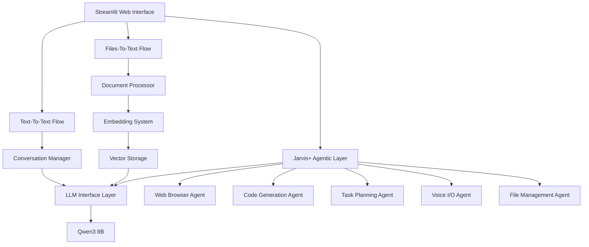
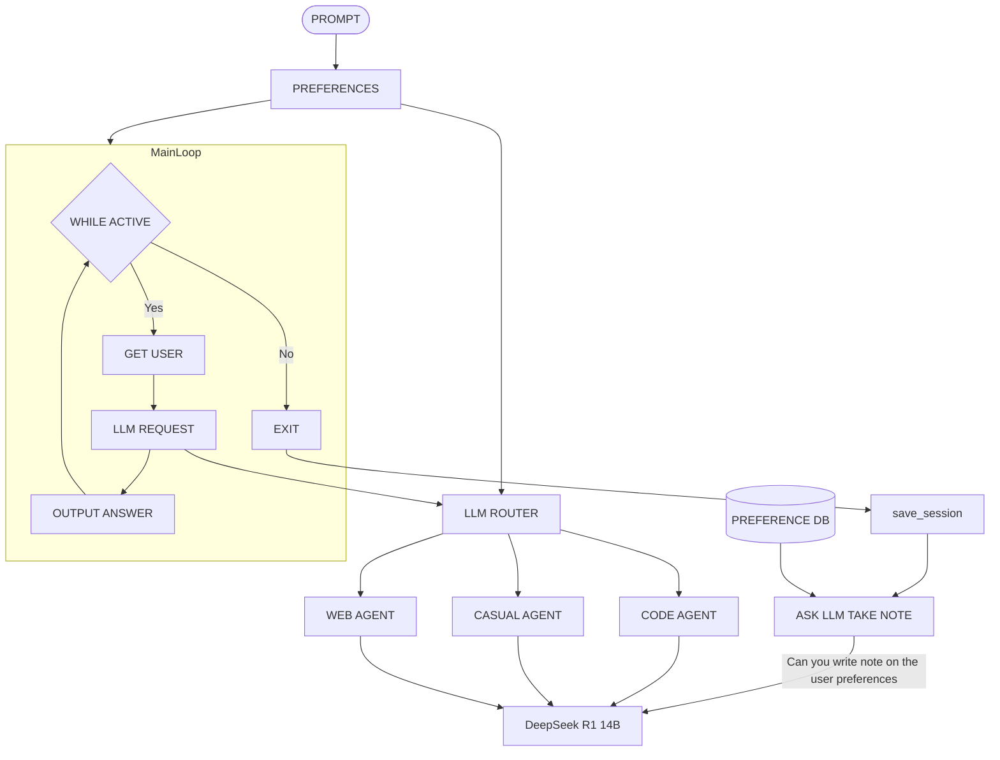
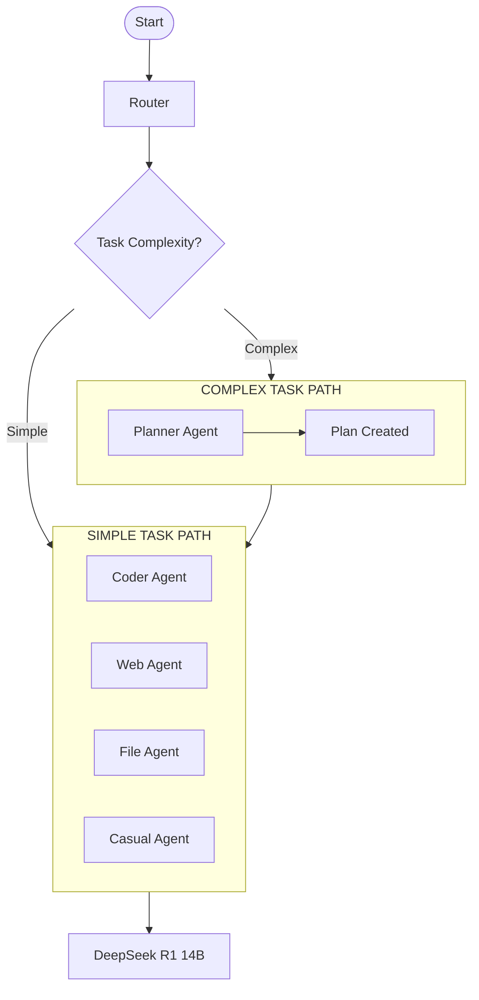
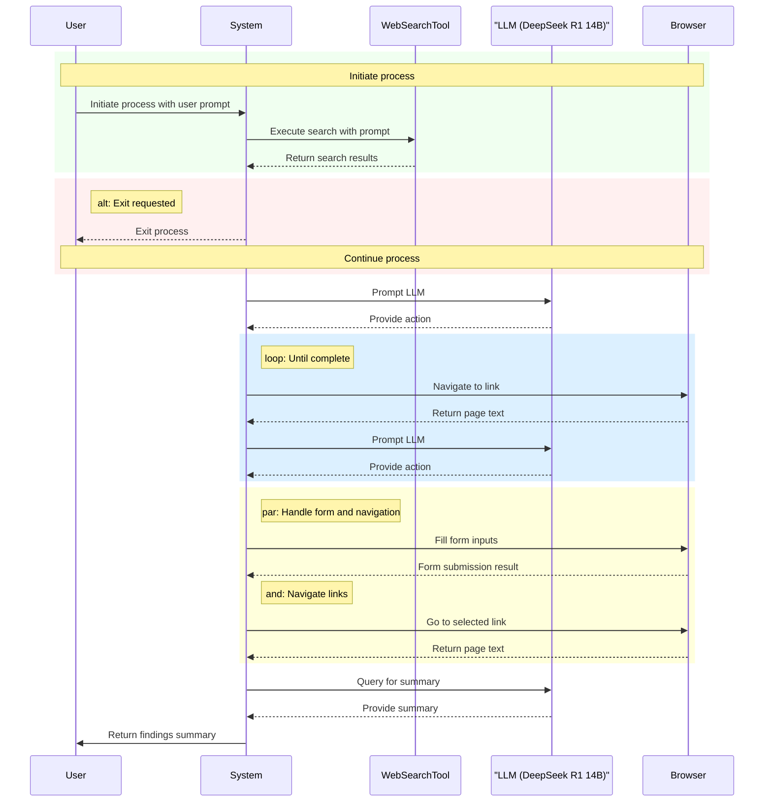

Updated: 29.4.2025 | 01:55 PM
### What's New (For Jarvis AI Core)
- Replaced DeepSeek R1 14B and Gemma 3 4B with Qwen 3 8B
- Improved reasoning capabilities
- Enhanced multi-language support for over 100 languages

> ⚠️ **Note:** This documentation has been created from the point of view of the Jarvis AI Core. The complete and official documentation for Jarvis+ is not ready yet and will be added later with full details. The current documentation is only for temporary use. I think it's better to create three separate files: one for Jarvis AI Core, one for Jarvis+, and one for installing both together. This will help reduce confusion and make things clearer.

# Jarvis AI Project

## Demo Video

- [Watch Demo Video With Audio (on YouTube)](https://youtu.be/K3sOIwlo_do?feature=shared)

## Table of Contents
1. [Introduction](#introduction)
2. [System Overview](#system-overview)
3. [Key Features & Capabilities](#key-features--capabilities)
4. [System Requirements](#system-requirements)
5. [Architecture Overview](#architecture-overview)
6. [AI Models](#ai-models)
7. [Core Components](#core-components)
8. [System Diagrams](#system-diagrams)
9. [Installation Guide](#installation-guide)
10. [Configuration](#configuration)
11. [Usage Instructions](#usage-instructions)
12. [Troubleshooting](#troubleshooting)
13. [Future Development](#future-development)
14. [Support & Contribution](#support--contribution)

---

## Introduction

Welcome to the Jarvis AI project! You can find all the project files on GitHub here: [https://github.com/Adarsh-61/JarvisPlus](https://github.com/Adarsh-61/JarvisPlus).

First of all, let's talk about the name "Jarvis." If you're a fan of the Iron Man movies, you'll recognize it. It stands for "Just A Rather Very Intelligent System," the name of Tony Stark's AI assistant. Our project takes inspiration from that concept.

Jarvis AI is a powerful Artificial Intelligence (AI) assistant designed to work completely **offline** on your own computer. This means it doesn't need an internet connection to function (after the initial setup) and doesn't send your data to external servers, ensuring your privacy. It uses advanced AI models to understand language, process documents efficiently, browse the web autonomously, generate code, and much more.

Building this has been a significant undertaking, and I want to express my sincere gratitude to everyone who supported me: the vibrant open-source community, my friends, dedicated mentors, and inspiring teachers. Your contributions and encouragement have been invaluable.

---

## System Overview

The Jarvis AI project is split into two main components:

1. **Jarvis AI Core:** This is the foundation of the system and handles tasks like understanding and generating text (Text-to-Text) and analyzing the content of your files like PDFs or text documents (Files-to-Text). Think of it as the core brain for text-based tasks.

2. **Jarvis+:** This is the more advanced, agentic part of the project. "Agentic" means it can act more independently and handle a wider variety of tasks, converting almost any type of input to any type of output (Any-to-Any). Jarvis+ adds capabilities like web browsing, code generation, task planning, voice interaction, and more.

Jarvis AI is built with performance, privacy, and flexibility in mind. We've leveraged advanced AI models (LLMs) extensively during development to optimize the codebase, enhance performance, and ensure everything works as smoothly as possible. It brings sophisticated AI capabilities, usually found in large enterprise systems, right to your local machine.

Whether you want to chat with an AI, get help writing something, analyze documents, browse the web autonomously, or generate code, Jarvis AI provides a reliable and private solution that runs entirely on your own hardware.

---

## Key Features & Capabilities

### Jarvis AI Core Features

#### Text-To-Text Conversion
- Engage in natural conversations with the AI
- Ask questions, seek advice, or generate content
- Maintain conversation context for follow-up questions
- Receive detailed, informative responses

#### Files-To-Text Conversion
- Upload documents (PDFs, text files) for AI analysis
- Ask questions about document content
- Generate summaries and extract key information
- Analyze multiple documents simultaneously

#### Core Capabilities
- **Fully Offline Operation**: All processing occurs locally on your machine, ensuring complete privacy and data security
- **Advanced Document Processing**: Optimized extraction, chunking, and caching for efficient document handling
- **Contextual Understanding**: Maintains conversation context for natural follow-up questions and coherent discussions
- **Streaming Responses**: Real-time response generation with token-by-token streaming for immediate feedback
- **Memory Management**: Sophisticated memory handling to optimize performance across different hardware configurations

### Jarvis+ Advanced Capabilities

| Capability             | Description                                    |
|------------------------|------------------------------------------------|
| **Autonomous Browsing**| Hands‑free web search, form filling, data extraction |
| **Code Generation**    | Write, debug, and run code in Python, Go, Java, etc. |
| **Task Planning**      | Break down complex tasks into actionable steps   |
| **Voice I/O**          | Speech‑to‑text trigger and text‑to‑speech output |
| **File Management**    | Search, read, and operate on your local filesystem |
| **Custom Workflows**   | Chain multiple agents for multi‑stage processes |

---

## System Requirements

### Hardware Requirements

**Minimum Requirements:**
- **RAM**: 16 GB
- **Storage**: SSD with at least 50 GB free space
- **CPU**: Intel i5 10th Gen or equivalent
- **GPU**: Optional, but recommended for better performance

**Recommended Specifications:**
- **RAM**: 32 GB or more
- **GPU**: 12 GB VRAM for 14B models; 24 GB+ for 32B+ models
- **Storage**: NVMe SSD with 100+ GB free space
- **CPU**: Intel i7/i9 13th/14th Gen or equivalent

### Software Requirements

- **Operating System**: Compatible with Windows, Linux, and macOS
- **Python**: Version 3.10 or newer
- **Docker & Docker Compose**: For containerized components
- **Ollama or alternative LLM provider**: For local models

The system is designed to be scalable and can be adjusted to work with various hardware configurations. Performance will scale with better hardware, particularly in terms of processing speed and the ability to handle larger documents and more complex tasks.

---

## Architecture Overview

Jarvis AI follows a modular architecture designed for efficiency and scalability. The system is built around multiple conversion pipelines, with Jarvis AI Core handling Text-To-Text and Files-To-Text, and Jarvis+ extending this with agentic capabilities.

### High-Level Architecture


### Text-To-Text Pipeline

The Text-To-Text pipeline handles conversational interactions without document context:

1. **User Input**: Received through the Streamlit web interface
2. **Conversation Manager**: Maintains history and context for coherent interactions
3. **Prompt Formatting**: Constructs prompts with conversation context and user queries
4. **LLM Processing**: Sends formatted prompts to Qwen 3 8B model
5. **Response Streaming**: Returns generated responses in real-time to the user

### Files-To-Text Pipeline

The Files-To-Text pipeline processes documents and enables document-based interactions:

1. **Document Upload**: User uploads PDF or text files through the interface
2. **Document Processing**: Extracts text and splits into manageable chunks
3. **Embedding Generation**: Creates vector representations using BGE M3 model
4. **Vector Storage**: Indexes embeddings for efficient similarity search
5. **Query Processing**: Retrieves relevant document chunks based on user queries
6. **Context Building**: Combines retrieved chunks with user queries
7. **LLM Processing**: Sends context-enriched prompts to the Qwen 3 8B model 
8. **Response Streaming**: Returns generated responses in real-time to the user

---

## AI Models

Jarvis AI is designed to be future-ready, allowing you to choose and use any model according to your preferences or system requirements. However, here we provide detailed information about the models used in the current implementation.

### Qwen 3 8B (In Jarvis AI Core)

#### Model Introduction

**Simple Explanation:**
Qwen 3 8B is a powerful and versatile AI language model developed by the Qwen team at Alibaba Cloud. As part of the Qwen3 series, it represents a significant advancement over previous versions, offering strong capabilities in understanding and generating text across a wide range of tasks. Think of it as a highly capable digital assistant that can handle complex reasoning, write code, understand multiple languages, and engage in natural conversations. It's designed to be efficient enough to run on reasonably powerful local hardware while delivering performance comparable to much larger models in many areas, making sophisticated AI accessible without relying solely on cloud services.

**Technical Explanation:**
Qwen3-8B is a dense, decoder-only causal language model with 8.2 billion parameters (6.95 billion non-embedding parameters). It belongs to the Qwen3 family, which features improvements in training data, model architecture, and optimization techniques compared to the earlier Qwen2.5 series. Key advancements include pre-training on a vastly expanded and higher-quality corpus of approximately 36 trillion tokens spanning 119 languages, incorporating architectural refinements like qk layernorm, and utilizing a three-stage pre-training process focused on general knowledge, reasoning enhancement, and long-context capability. The model is released under the Apache 2.0 license, promoting open access and development. Notably, the post-trained/instruct version, typically accessed via commands like `ollama run qwen3`, supports a context length of 32,768 natively and 131,072 tokens with YaRN.

#### Working Mechanism

Qwen3-8B processes input text using a transformer-based architecture. Text is tokenized and fed through 36 transformer layers. It employs Grouped-Query Attention (GQA) with 32 attention heads for queries (Q) and 8 heads for keys/values (KV) to balance performance and computational efficiency. The architecture incorporates qk layernorm for improved stability and performance. The model was trained using a three-stage pre-training strategy:
1.  **Stage 1 (S1):** Focused on broad language modeling and general knowledge acquisition using over 30 trillion tokens with a 4K context length.
2.  **Stage 2 (S2):** Enhanced reasoning skills by increasing the proportion of knowledge-intensive data (STEM, coding, reasoning) and training on an additional 5 trillion tokens.
3.  **Stage 3 (S3):** Extended context handling capabilities up to 32K tokens using high-quality long-context data. The instruct-tuned version further extends this to 131,072 tokens.

Post-training involved a four-stage pipeline including long chain-of-thought (CoT) cold start, reasoning-based reinforcement learning (RL), thinking mode fusion, and general capability alignment to develop its hybrid thinking modes and enhance instruction following.

#### Technologies Used

Qwen3-8B leverages several advanced technologies:

*   **Architecture:** Decoder-only Transformer, Grouped-Query Attention (GQA), qk Layernorm.
*   **Training Techniques:** Three-stage pre-training, Scaling Law guided hyperparameter tuning, advanced post-training pipeline (RL, SFT).
*   **Frameworks/Tools (Inference):** Designed for use with Hugging Face Transformers (`>=4.51.0`), vLLM, SGLang, Ollama (`>=0.6.6`), LMStudio, MLX, llama.cpp (`>=b5092`), KTransformers.
*   **License:** Apache 2.0.

*(Note: Specific details on activation functions, optimization algorithms, and loss functions beyond the architectural elements mentioned in the sources (like qk layernorm) were not readily available in the reviewed documentation but likely involve standard practices like AdamW optimizer and cross-entropy loss, potentially augmented with techniques used in the RL stages.)*

#### Benchmarks and Performance Metrics

According to the official Qwen blog and related materials, Qwen3 models demonstrate strong performance across various benchmarks. Qwen3-8B (specifically the base model) is reported to achieve performance comparable to the previous generation Qwen2.5-14B-Base model, with particular improvements noted in STEM, coding, and reasoning tasks. The instruct-tuned Qwen3-8B model shows significantly enhanced reasoning capabilities and superior human preference alignment compared to previous Qwen models.

Key performance highlights include:
*   Strong multilingual capabilities across 119 languages.
*   Enhanced reasoning, math, and coding abilities.
*   Improved performance on agentic tasks and tool use (MCP).
*   Competitive results compared to other models in its size class.

For detailed, up-to-date benchmark scores across specific tests (like MMLU, HumanEval, MATH, etc.), users are encouraged to consult the official Qwen3 blog post and documentation linked in the sources.

#### Capabilities and Limitations

**Key Strengths:**
*   **Strong Reasoning and Coding:** Significantly improved performance in logical reasoning, mathematical problem-solving, and code generation.
*   **Extensive Multilingual Support:** Understands and generates text in 119 languages and dialects.
*   **Long Context Window:** Supports up to 128K tokens (instruct version), enabling processing of very long documents or conversations.
*   **Hybrid Thinking Modes:** Offers flexibility between step-by-step reasoning (`/think` or default) for complex tasks and faster responses (`/nothink`) for simpler queries.
*   **Agentic Capabilities:** Optimized for interacting with external tools and performing complex agent-based tasks.
*   **Efficiency:** Achieves performance comparable to larger previous-generation models while being more parameter-efficient.
*   **Open Source:** Released under the permissive Apache 2.0 license.

**Limitations:**
*   As an 8B parameter model, it may still underperform significantly larger models (e.g., 70B+ or MoE models) on extremely complex or nuanced tasks.
*   Like all LLMs, it can potentially generate factually incorrect or biased information (hallucinations).
*   Knowledge is limited to the data it was trained on (cutoff date applies).
*   Optimal performance, especially for the 128K context, requires sufficient hardware resources (RAM and potentially VRAM).
*   Performance can vary across the 119 supported languages, likely being strongest in higher-resource languages present in the training data.

#### Usage with Ollama

To run the Qwen 3 8B model locally using Ollama (version 0.6.6 or higher required), use the following command after ensuring the Ollama service is running:

```bash
ollama run qwen3
```

#### Role in Jarvis AI Core

Within the **Jarvis AI Core** component, Qwen 3 8B serves as the primary language model. It handles the core functionalities: the **Text-To-Text** conversion pipeline (general conversation, question answering, content generation) and the **Files-To-Text** pipeline (document analysis, summarization, Q&A over documents). Its strong reasoning, extensive multilingual support, and long context window enable Jarvis AI Core to tackle these tasks effectively on local hardware. *Note: For the advanced agentic capabilities provided by **Jarvis+** (such as web browsing, code generation, and task planning), the DeepSeek R1 14B model is utilized instead (see its dedicated section).*

---
*Sources: [Qwen3 Blog](https://qwenlm.github.io/blog/qwen3/), [Qwen3 GitHub](https://github.com/QwenLM/Qwen3), [Qwen3-8B-Base Hugging Face](https://huggingface.co/Qwen/Qwen3-8B-Base)*

### DeepSeek R1 14B

*(Note: This section describes the DeepSeek R1 14B model, which is utilized for the advanced agentic capabilities within Jarvis+.)*

#### Model Introduction

**Simple Explanation:**
DeepSeek R1 14B is an advanced AI language model specifically designed to excel at reasoning tasks. Unlike models primarily focused on general text generation, DeepSeek R1 14B can demonstrate its step-by-step thinking process, making it particularly valuable for complex tasks requiring logical inference, mathematical problem-solving, planning, and interaction with tools (agentic behavior). Think of it as an AI that doesn't just give answers but explains *how* it arrived at them, crucial for the sophisticated operations performed by Jarvis+.

**Technical Explanation:**
DeepSeek R1 14B (specifically, DeepSeek-R1-Distill-Qwen-14B) is a 14 billion parameter dense, decoder-only transformer model. It is a distilled version derived from the larger, more complex DeepSeek-R1 model, using the Qwen2.5 14B architecture as a base. Its unique strength comes from being trained using a novel approach that heavily emphasizes reinforcement learning (RL) to directly incentivize reasoning capabilities, rather than relying solely on supervised fine-tuning (SFT) from human examples. This RL-centric training allows emergent capabilities like chain-of-thought (CoT) reasoning, self-verification, and reflection, which are vital for agentic tasks.

#### Working Mechanism

DeepSeek R1 14B processes input through a transformer decoder architecture based on Qwen2.5. Key architectural features include:
*   **Parameters:** ~14 billion.
*   **Attention:** Grouped-Query Attention (GQA) for efficiency.
*   **Normalization:** RMSNorm.
*   **Positional Embedding:** Rotary Positional Embedding (RoPE).
*   **Activation:** SwiGLU in feed-forward networks.
*   **Context Window:** 32,768 tokens.

The model's distinct reasoning ability stems from its training pipeline, which involved:
1.  Starting with a base model (Qwen2.5 14B).
2.  Distilling knowledge and reasoning patterns from the larger DeepSeek-R1 model (a 671B MoE model).
3.  Fine-tuning using samples curated with DeepSeek-R1, likely involving RL stages focused on reasoning and human preference alignment, potentially seeded with SFT data.

#### Technologies Used

DeepSeek R1 14B leverages several key technologies:

*   **Architecture:** Qwen2.5-based Transformer, GQA, RMSNorm, RoPE, SwiGLU.
*   **Training Techniques:** Knowledge Distillation, Reinforcement Learning (likely PPO or similar), potentially SFT.
*   **Frameworks/Tools (Inference):** Hugging Face Transformers, PyTorch, Ollama, CUDA.
*   **License:** MIT License (based on the distilled version's Hugging Face page).

*(Note: Specific details on optimization algorithms and loss functions beyond the general RL/distillation approach were not fully detailed in the reviewed sources but likely include standard practices like AdamW and cross-entropy, augmented with RL-specific objectives.)*

#### Benchmarks and Performance Metrics

DeepSeek R1 14B (Distill-Qwen-14B) demonstrates strong performance, particularly in reasoning, math, and coding benchmarks, often outperforming models of similar or even larger sizes in these specific areas:

*   **AIME 2024 (Pass@1):** 69.7%
*   **MATH-500 (Pass@1):** 93.9%
*   **GPQA Diamond (Pass@1):** 59.1%
*   **LiveCodeBench (Pass@1-COT):** 53.1%
*   **Codeforces (Rating):** 1481

It significantly outperforms models like GPT-4o and Claude-3.5-Sonnet on mathematical reasoning (AIME, MATH-500) and is competitive with OpenAI's o1-mini on coding and reasoning tasks, despite being a dense 14B model.

#### Capabilities and Limitations

**Key Strengths:**
*   **Exceptional Reasoning:** Excels at tasks requiring step-by-step logical deduction, mathematical problem-solving, and planning.
*   **Strong Coding Abilities:** High performance on coding benchmarks.
*   **Emergent Behaviors:** Demonstrates capabilities like self-verification and reflection learned through RL.
*   **Good Context Length:** 32K token context window.
*   **Open Source (Distilled Version):** Available under an MIT license.

**Limitations:**
*   May be less performant on general knowledge or creative writing compared to models trained more broadly.
*   Reasoning, while strong, can still be flawed or produce plausible but incorrect steps.
*   Knowledge cutoff date applies.
*   Requires significant VRAM (likely 16GB+) for efficient local operation.

#### Role in Jarvis+

Within the Jarvis+ system, DeepSeek R1 14B serves as the primary language model for handling **advanced agentic tasks**. Its strong reasoning and coding capabilities make it ideal for the Web Browser Agent, Code Generation Agent, Task Planning Agent, and potentially other complex workflows that require multi-step thinking, interaction with tools, or logical deduction. It is specifically chosen for Jarvis+ due to its demonstrated strengths in these reasoning-intensive areas, complementing the Qwen 3 8B model used for the core text and file processing in Jarvis AI Core.

---
*Sources: [DeepSeek-R1-Distill-Qwen-14B Hugging Face](https://huggingface.co/deepseek-ai/DeepSeek-R1-Distill-Qwen-14B), [DeepSeek R1 Paper (arXiv:2501.12948)]()*


### BGE M3

#### Model Introduction

**Simple Explanation:**
BGE M3 is a versatile text embedding model that excels at understanding and comparing text across multiple languages. Think of it as a translator that converts text into numerical representations (vectors) that capture the meaning of the content. What makes BGE M3 special is its "3M" capabilities: it works with multiple languages (over 100), performs multiple functions (dense, sparse, and multi-vector retrieval), and handles multiple text lengths (from short sentences to long documents). This makes it particularly powerful for applications like search engines, question-answering systems, and document retrieval where understanding the meaning of text is crucial.

**Technical Explanation:**
BGE M3 (Beijing Academy of Artificial Intelligence Multi-lingual, Multi-functionality, Multi-granularity Embedding) is an advanced text embedding model built on the XLM-RoBERTa architecture. It generates 1024-dimensional vector representations of text that capture semantic meaning across languages and contexts. The model is designed with a unique self-knowledge distillation approach that enables it to simultaneously perform three distinct retrieval functionalities: dense retrieval (single vector representation), sparse retrieval (token-level importance weights), and multi-vector retrieval (ColBERT-style token embeddings). This unified approach allows for more effective information retrieval across varying text lengths up to 8192 tokens.

#### Working Mechanism

BGE M3 processes input data through a sophisticated pipeline that handles text in multiple ways. Input text is first tokenized using the XLM-RoBERTa tokenizer, which supports over 100 languages. The tokens are then processed through the transformer-based architecture. The model simultaneously generates three types of outputs: dense embedding (the [CLS] token embedding is used as a single vector representation of the entire text), sparse embedding (token-level importance weights are generated for lexical matching), and ColBERT embeddings (multiple token-level embeddings are produced for fine-grained matching).

The model is built on the XLM-RoBERTa architecture with 12 transformer layers with multi-head self-attention, approximately 560 million parameters, and 1024-dimensional output embeddings. It includes specialized heads for different functionalities: a dense head that projects the [CLS] token representation to a 1024-dimensional vector, a sparse head that generates importance weights for each token in the vocabulary, and a ColBERT head that produces contextualized embeddings for each token.

BGE M3 was trained through a comprehensive process that included data curation from unsupervised multilingual corpora, supervised data from related tasks, and synthesized training data for scarce languages and scenarios. It employs a novel self-knowledge distillation approach where different retrieval functionalities mutually reinforce each other, with relevance scores from different retrieval functions integrated as teacher signals.

#### Technologies Used

BGE M3 employs several key technologies:

**Activation Functions:**
- GELU (Gaussian Error Linear Unit) in feed-forward networks
- Softmax in attention mechanisms
- LayerNorm for normalizing activations
- Tanh for bounded activation in certain components

**Optimization Algorithms:**
- AdamW optimizer with weight decay
- Cosine learning rate schedule with warmup
- Gradient clipping to prevent exploding gradients
- Mixed precision training for computational efficiency

**Loss Functions:**
- Contrastive Loss for dense embeddings
- Knowledge Distillation Loss for self-knowledge distillation
- Cross-Entropy Loss for token importance prediction
- MaxSim Loss for multi-vector retrieval

**Frameworks/Tools:**
- PyTorch as the primary deep learning framework
- Hugging Face Transformers library
- FAISS for efficient vector search
- FlagEmbedding custom library
- Sentence-Transformers for integration with existing pipelines

#### Benchmarks and Performance Metrics

BGE M3 demonstrates exceptional performance across various benchmarks:

- **MTEB (Massive Text Embedding Benchmark)**: State-of-the-art performance across multiple languages
- **MIRACL**: Leading results in multilingual information retrieval across 18 languages
- **MKQA (Multilingual Knowledge Questions & Answers)**: Superior performance in cross-lingual question answering
- **MLDR (Multilingual Long Document Retrieval)**: Excellent results on long document retrieval across 13 languages
- **BEIR**: Strong performance on diverse retrieval tasks

BGE M3 outperforms specialized monolingual models on many language-specific tasks, exceeds performance of previous multilingual embedding models like mUSE and LaBSE, and is competitive with or superior to OpenAI's text-embedding-ada-002 on English tasks.

In terms of efficiency, it can process approximately 100-200 documents per second on a single GPU, is optimized for handling long documents with limited memory, and has low latency suitable for real-time applications.

#### Capabilities and Limitations

**Key Strengths:**
- Versatile retrieval combining dense, sparse, and multi-vector approaches in a single model
- Superior performance across 100+ languages
- Effective handling of documents up to 8192 tokens
- Powerful hybrid search combining semantic and lexical matching
- Zero-shot capability for unseen languages and domains
- Fully open-source with MIT license
- Easy integration with existing retrieval systems

**Limitations:**
- Requires significant computational resources for processing long documents
- Self-knowledge distillation approach is complex to replicate for fine-tuning
- Performance varies across languages, with better results for high-resource languages
- May require fine-tuning for highly specialized domains
- Text-only model without native image or audio understanding
- Limited to 8192 tokens, which may be insufficient for very long documents
- Slower than some lighter embedding models, especially for the full multi-functional output

#### Role in Jarvis AI Core

In Jarvis AI Core, BGE M3 serves as the embedding model for the Files-To-Text conversion pipeline. It converts document chunks into vector representations that can be efficiently stored and retrieved. Its multilingual capabilities ensure effective document understanding across different languages, while its hybrid retrieval approach enables more accurate identification of relevant document sections when answering user queries.

BGE M3 was selected for this role because of its exceptional versatility in embedding generation, which is crucial for the Files-To-Text conversion pipeline. Its ability to process documents in multiple languages and generate high-quality embeddings for both short and long texts makes it ideal for creating vector representations of document chunks. The model's multilingual capabilities ensure effective document understanding across different languages, aligning perfectly with Jarvis AI Core's goal of providing a versatile AI assistant. Additionally, its combination of dense, sparse, and multi-vector retrieval enables more accurate identification of relevant document sections, and its MIT license allows for unrestricted use and modification.

### Model Customization

Jarvis+ lets you swap any supported model:
- **Local**: Ollama, LM‑Studio, LLaMA.cpp  
- **Remote API**: OpenAI GPT‑4o, Hugging Face, Deepseek API  

Update `provider_name` and `provider_model` in `config.ini` to experiment. Jarvis+ adapts automatically to the capabilities of the selected model.

---

## Core Components

Jarvis AI Core consists of several key components that work together to provide its capabilities.

### Document Processing System

The document processing system handles document uploads, text extraction, and preparation for embedding and retrieval:

- **Document Loader**: Supports PDF and text files with specialized processing for each format
- **Text Extraction**: Uses PyMuPDF with pdfplumber fallback for robust PDF extraction
- **Chunking Strategy**: Divides documents into manageable pieces while preserving context
- **Caching Mechanism**: Avoids redundant processing of previously seen documents

Key features include:
- Parallel processing for efficient document handling
- Memory mapping for large file processing
- Error recovery for handling corrupted or malformed files
- Automatic cleanup of temporary files

### Embedding System

The embedding system converts text chunks into vector representations for efficient retrieval:

- **BGE M3 Integration**: Uses state-of-the-art multilingual embedding model
- **Vector Representation**: Creates high-dimensional vectors that capture semantic meaning
- **Batch Processing**: Generates embeddings in batches for efficiency
- **Normalization**: Ensures consistent similarity calculations

### Vector Storage

The system uses FAISS (Facebook AI Similarity Search) for efficient vector storage and retrieval:

- **Efficient Indexing**: Enables fast similarity search across document chunks
- **Incremental Updates**: Supports adding new documents without rebuilding the index
- **Similarity Metrics**: Uses cosine similarity for semantic matching
- **Batched Operations**: Processes documents in batches to manage memory usage

### LLM Integration

Jarvis AI integrates powerful language models for text generation and understanding, utilizing specific models for different components:

- **Qwen 3 8B (Jarvis AI Core)**: Serves as the core language model for the Text-To-Text and Files-To-Text pipelines, handling general conversation, document analysis, and Q&A.
- **DeepSeek R1 14B (Jarvis+)**: Utilized for advanced agentic tasks within Jarvis+, leveraging its strong reasoning capabilities for web browsing, code generation, and planning.
- **Streaming Interface**: Provides real-time response generation for both models.
- **Context Management**: Effectively handles conversation history and document context, routing tasks to the appropriate model via the LLM Interface Layer.

### User Interface

The user interface provides a seamless experience for interacting with Jarvis+:

- **Conversion Mode Selection**: Switch between Text-To-Text and Files-To-Text modes
- **Document Upload**: Easy interface for uploading and processing documents
- **Chat Interface**: Familiar chat-like interface for conversations
- **Response Streaming**: Real-time display of AI responses as they're generated

---

## System Diagrams For Jarvis+

### Overall System Architecture

The following diagram illustrates the overall system architecture of Jarvis+, showing how different components interact:



### Task Routing System

The routing system determines how tasks are processed based on their complexity:



### Autonomous Web Search Process

The web agent handles autonomous web browsing and information extraction:



### AI Code Execution Process

The code agent handles code generation, execution, and debugging:


---

## Installation Guide

This guide provides step-by-step instructions for installing Jarvis+.

### Prerequisites

Before installing, ensure you have the following:

- Operating system: Windows, Linux, or macOS
- Python 3.10 or newer
- At least 16GB RAM
- 50GB+ free disk space
- Administrator privileges (for Windows) or sudo access (for Linux/macOS)

### Step 1: Clone & Prepare

```bash
git clone https://github.com/Adarsh-61/JarvisPlus.git
cd JarvisPlus
mv .env.example .env
```

### Step 2: Set Up Virtual Environment

```bash
python3 -m venv venv
source venv/bin/activate    # Windows: venv\Scripts\activate
```

### Step 3: Install Dependencies

```bash
# Automatic installation
./install.sh    # Linux/macOS

# Manual installation
pip install -r requirements.txt
```

### Step 4: Install Ollama

1. Download Ollama for your operating system from [ollama.com/download](https://ollama.com/download)
2. Install following the on-screen instructions
3. Verify installation by running `ollama --version` in your terminal

### Step 5: Download Required Models

Download the necessary language models using Ollama. Both models are required:

```bash
# Model for Jarvis AI Core (Text/File processing)
ollama pull qwen3

# Model for Jarvis+ (Agentic features)
ollama pull deepseek-r1:14b
```

### Step 6: Launch Services

Start the services:
```bash
sudo ./start_services.sh   # macOS/Linux
start ./start_services.cmd # Windows
```

Launch the application:
```bash
# Streamlit interface
streamlit run app.py
# Then browse to http://localhost:8051

# CLI mode
python cli.py

# Web interface (Currently Not Working)
python api.py
# Then browse to http://localhost:3000
```

---

## Configuration For Jarvis+

Jarvis+ can be configured through the `config.ini` file in the project root directory. The application internally routes tasks to the appropriate model based on the context.

### Main Configuration

```ini
[MAIN]
is_local = True
provider_name = ollama
provider_model = deepseek-r1:14b 
provider_server_address = 127.0.0.1:11434
agent_name = Edith
recover_last_session = False
save_session = False
speak = True
listen = False
work_dir = /JarvisPlus-main/temp_folder
jarvis_personality = False
languages = en
```

### Browser Configuration

```ini
[BROWSER]
headless_browser = False
stealth_mode = True
```

---

## Usage Instructions

Jarvis AI provides an intuitive interface for both Text-To-Text and Files-To-Text interactions, as well as advanced agentic capabilities.

### Text-To-Text Mode

In this mode, you can have direct conversations with the AI without document context:

1. Ensure "Text-To-Text" is selected in the sidebar
2. Type your question or prompt in the input field
3. Press Enter or click the send button
4. View the AI's response as it streams in real-time
5. Continue the conversation with follow-up questions

Example interactions:
- "Explain the concept of quantum computing"
- "Write a short story about a space explorer"
- "What are the key principles of effective communication?"

### Files-To-Text Mode

In this mode, you can interact with documents and ask questions about their content:

1. Select "Files-To-Text" in the sidebar
2. Upload one or more documents using the file uploader
3. Wait for the documents to be processed
4. Type your question about the documents in the input field
5. Press Enter or click the send button
6. View the AI's response, which will include relevant information from the documents

Example interactions:
- "Summarize the main points of this document"
- "What does the document say about [specific topic]?"
- "Compare the key arguments presented in these papers"

### Agentic Capabilities

Jarvis+ provides several advanced agentic capabilities:

#### Web Browsing

To use the web browsing capability:
```
Search for the latest research on quantum computing
```

The AI will autonomously search the web, navigate relevant pages, and provide a summary of the information found.

#### Code Generation

To generate and execute code:
```
Write a Python script to analyze sentiment in tweets
```

The AI will generate the code, explain how it works, and can execute it if requested.

#### Task Planning

For complex tasks that require planning:
```
Help me organize a conference for 100 people
```

The AI will break down the task into manageable steps and provide guidance for each step.

### Example Prompts

Use these to explore Jarvis+ :

| Category         | Prompt Example                                                         |
|------------------|------------------------------------------------------------------------|
| **Coding**       | "Generate a REST API in Python Flask for book reviews"                |
| **Web Search**   | "Find vegan street food tours in Mumbai"                              |
| **Data Analysis**| "Plot monthly rainfall trends in Delhi from data.csv"                  |
| **Travel**       | "Plan a 4‑day Rajasthan heritage tour with budget hotels"             |
| **Casual**       | "Describe the architectural style of Hawa Mahal in Jaipur"             |
| **System**       | "Locate all .pptx files in ~/Work"                                     |

---

## Troubleshooting

### Common Issues and Solutions

#### Installation Problems

**Issue**: Dependencies fail to install
**Solution**: 
1. Ensure you have the correct Python version (3.10+)
2. Try installing dependencies one by one to identify problematic packages
3. Check for system-specific requirements (e.g., build tools on Windows)

**Issue**: Ollama installation fails
**Solution**:
1. Check system compatibility
2. Ensure you have administrator/sudo privileges
3. Try manual installation from the Ollama GitHub repository

#### Model Loading Issues

**Issue**: Models fail to load or take too long
**Solution**:
1. Check available disk space and RAM
2. Verify Ollama is running (`ollama list` should show installed models)
3. Try restarting Ollama service
4. For large models, consider using quantized versions

#### Performance Problems

**Issue**: Slow response times
**Solution**:
1. Check hardware meets minimum requirements
2. Close other resource-intensive applications
3. Consider using smaller models or quantized versions
4. Adjust batch sizes and context lengths in configuration

#### Web Interface Issues

**Issue**: Web interface doesn't load
**Solution**:
1. Verify all services are running
2. Check port availability (default is 3000)
3. Clear browser cache
4. Try a different browser

### Getting Help

If you encounter issues not covered here:

1. Check the GitHub repository issues section
2. Post detailed problem descriptions including:
   - System specifications
   - Error messages
   - Steps to reproduce the issue

---

## Future Development

Please note that no major new features are planned for this version of the project. However, based on community demand, minor updates or fixes might still be made.

The next major version, **Mark I (Modular Autonomous Reasoning Kernel I)**, is planned for release in 2026, featuring:

- Advanced vision processing capabilities
- Enhanced multimodal understanding
- Improved reasoning and planning abilities
- More efficient resource utilization
- Expanded plugin ecosystem
- Streamlined deployment options

During this time, I will be dedicating the next year to deeply understanding and learning the various technologies involved, some of which I was previously unfamiliar with while building this project.

---

## Support & Contribution

This project is not built by me alone. It would not have been possible without the significant contributions, guidance, and inspiration from the open-source community, my friends, and my teachers. I would like to express my heartfelt thanks to all of them for their invaluable support.

### How to Contribute

I warmly welcome contributors to join and be a part of this project. If you have ideas, suggestions, or improvements, your contributions are always appreciated.

1. **Code Contributions**:
   - Fork the repository
   - Create a feature branch
   - Submit a pull request with detailed description

2. **Documentation**:
   - Help improve documentation
   - Create tutorials or guides
   - Translate documentation to other languages

3. **Testing**:
   - Report bugs and issues
   - Suggest improvements
   - Help with testing on different platforms

4. **Community Support**:
   - Answer questions in discussions
   - Share your experience with the project
   - Spread the word about Jarvis AI

### Acknowledgments

The entire codebase is optimized with AI models to ensure maximum performance and smooth working across a wide range of machines. Thank you for using Jarvis AI. Let's build the future of local AI together.
